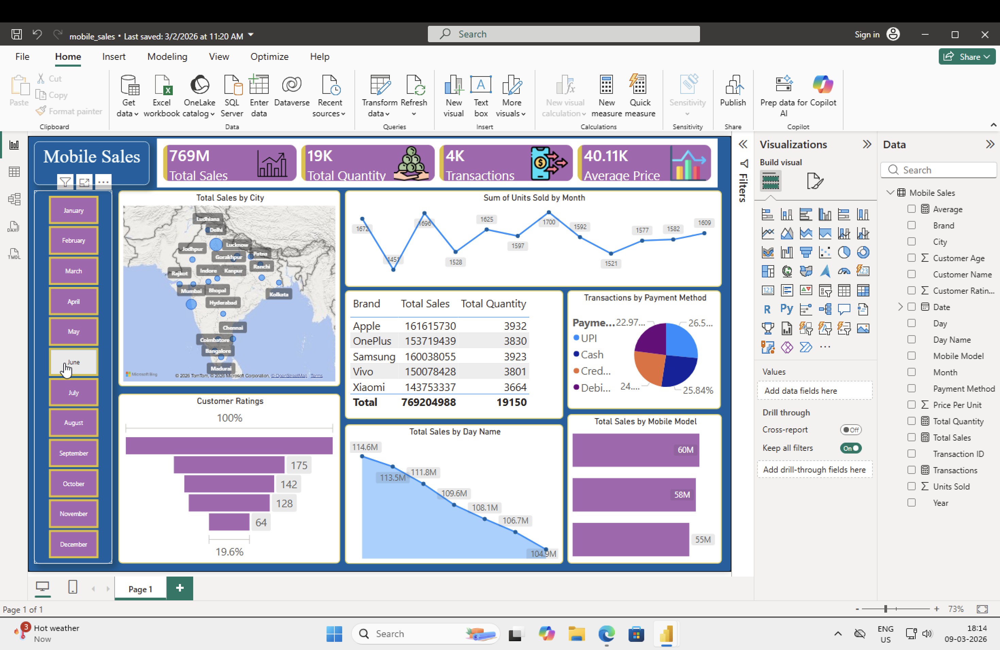

# 📊 Mobile Sales Dashboard (Power BI)

This project analyzes mobile phone sales data across multiple cities, brands, and payment methods.  
The dashboard provides insights into sales performance, customer behavior, and transaction trends.

## 🔍 Key Insights
- Total Sales: 769M
- Total Quantity Sold: 19K
- Total Transactions: 4K
- Average Price: 40.11K

## 📈 Dashboard Features
- Sales distribution across cities (Map visualization)
- Monthly sales trends
- Brand-wise sales and quantity comparison
- Payment method transaction analysis
- Customer rating distribution
- Mobile model sales performance
- Day-wise sales trends

## 🛠 Tools Used
- Power BI
- Data Modeling
- DAX
- Data Visualization

## 📷 Dashboard Preview

## 📂 Dataset
The dataset contains information about:
- Mobile brands and models
- Sales transactions
- Payment methods
- Customer ratings
- City-wise sales

## 🚀 Purpose
The goal of this project is to demonstrate **data visualization, dashboard design, and business insight generation using Power BI.**
